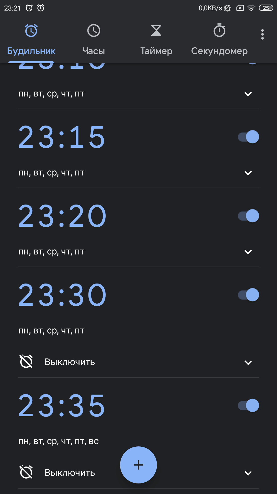
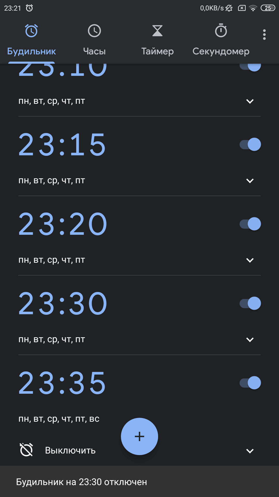
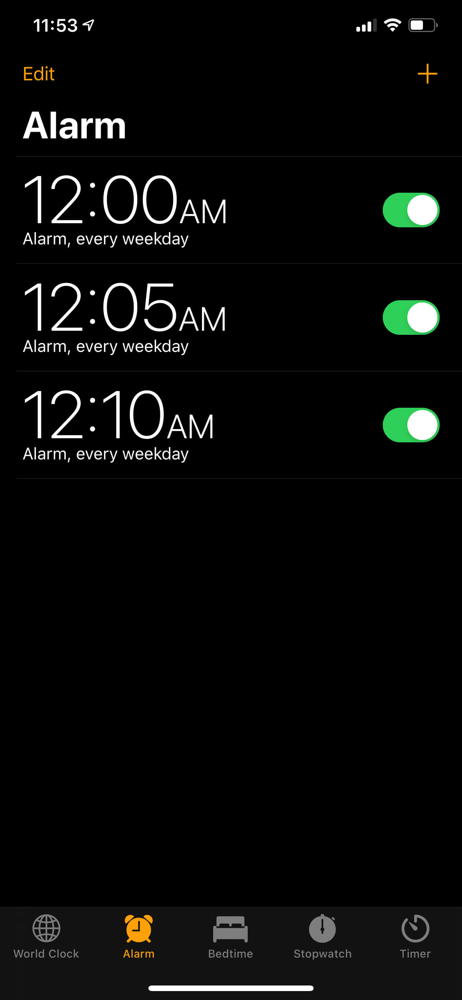
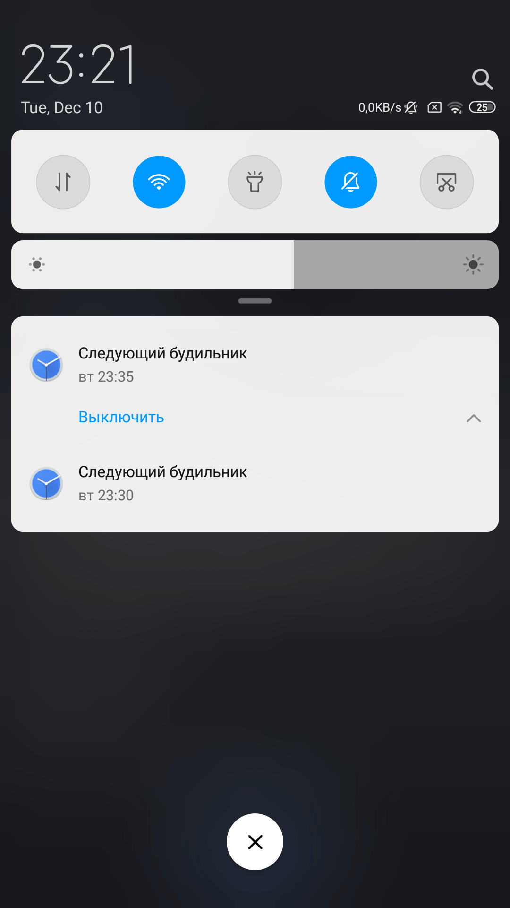
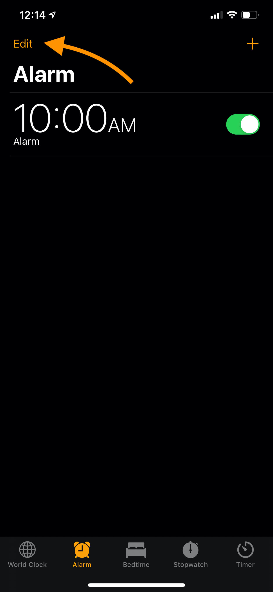
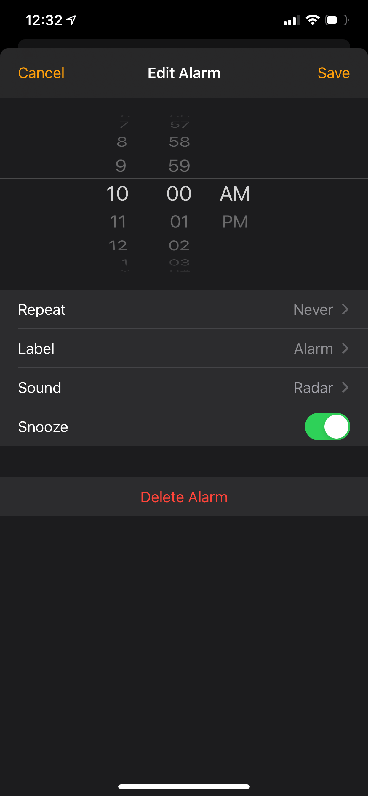
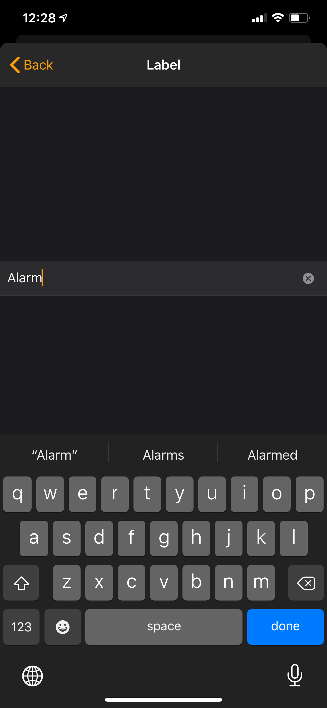
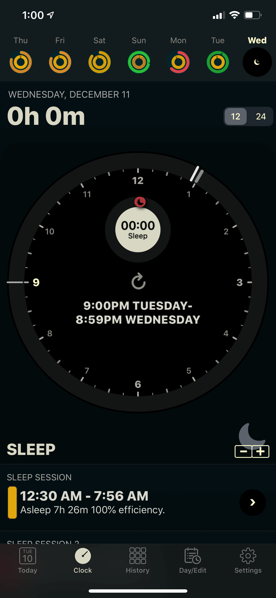

Я из тех людей, что ставят на один день несколько будильников с промежутком от 5 до 20 минут. Причина проста, я неосознанно выключаю будильник во сне. Каждый вечер и утро мне, эплорабу, приходится страдать открывая приложение «Часы» на своём айфоне.

Последние несколько лет я передически ходил с Google Pixel разных моделей как с основным устройством и как с дополнительным к айфону. Можно ненавидеть андроид со всеми его приколами, но такая банальная вещь как будильник, на андроид продумана до мелочей в сравнении с iOS. Как ни странно но именно после того, как я воспользовался будильником на андроиде, мне впервые захотелось выкинуть свой айфон в мусорку. Рассказываю.

## Выключение будильника, apple-way
Любое нормальное приложение (ИМХО) при выключении будильника спрашивает юзера выключить будильник один раз (сегодня) или выключить его на всё время. Либо имеет для этого отдельный элемент интерфейса.

*Видите кнопку выключить на будильниках 23:30 и 23:35? Я про это. В качестве подопытного, бомжефон от Къшэйомэ и гугловское приложение «Часы».*

Поясняю для чего это сделано. Скажем решил я сегодня выспаться и не хочу, чтобы утром будильник трезвонил. Или вот такой кейс: я проснулся раньше будильника и хочу его выключить **только** сегодня (в том смысле, что завтра он сработает в это же время). 

*Здесь я нажал кнопку «Выключить» у будильника на 23:30. Приложение заботливо подсказывает, что будильник на 23:30 отключен, но при этом видно, что он активен и будет дальше звонить в назначенные дни недели.*

Так вот, на iOS выключение будильника его просто выключает. С одной стороны это логично, с другой... У меня 5-8 будильников, а я, например, проснулся после 2-го. Значит сразу после того как я проснулся, мне нужно зайти в приложение и выключить каждый будильник, который должен прозвенеть в ближайшее время, а вечером не забыть зайти в приложение и включить все будильники обратно.

**И так каждый день!**
 

*Невероятное нихрена на iOS.*

В гугле (или кто там пилил это приложение) пошли дальше и сделали выключение будильника ещё удобнее. Если в ближайшее время (сколько точно я не знаю) должен прозвонить будильник, приложение заболиво выводит в панель уведомлений список этих будильников с возможностью их выключить не переходя в приложение, *гениально!*

У меня насколько трещит жопа каждый раз утром выключать и вечером включать все будильники, что мне пришлось сделать скрипт, который делает это в один клик через стандартное приложение Shortcuts. 

## Чумовое юзабилити
Отдельную премию всратости можно вручить Apple за юзабилити. Самая часто нажимаемая кнопка «Edit» находится в самом сука неудобном месте.

*Я так понял, что дизайнер который это делал, в прошлом пианист.*

Я со своими весьма не короткими пальцами, с трудом дотягиваюсь до противоположного края экрана чтобы нажать заветную кнопку. Зачем это сделано, известно только в эпл. Ничего не мешало сделать collapsible блок или добавить рекатирование в меню, которое открывается по свайпу будильника влево или вправо.

Не менее встратый и экран редактирования будильника, где редактирование части настроек пробрасывает тебя в другие экраны, где нужно будет по нескольку раз нажимать «Back», чтобы вернуться назад.

## Анальная огороженность Apple
Любопытный читатель наверняка задался вопросом, а почему бы не поставить другое приложение и перестать страдать? Я подумал так же, но забыл что это эпл.

Сторонние приложения как ни странно есть, только из-за ограничений системы, нормально работать они не могут.

Первое ограничение в том, что сторонние приложения не могут показать что-то поверх экрана блокировки, вообще, никак. Это значит для того, чтобы выключить будильник, телефон нужно сначала разблокировать. 

В жизни это выглядит так. Берешь телефон в руки чтобы выключить будильник, FaceID безуспешно пытается отсканировать твоё помятое лицо с полу-закрытыми глазами из-за того, что экран лупит подсветкой в лицо. Дальше ты будучи таким же сонным с 3-ей попытки вводишь пароль блокировки вручную и только после этого ты выключаешь будильник, если уже не разбил телефон от злости. Apple-way, чё.

Чуть не забыл, открыться приложение само тоже не может, поэтому сначала ты зайдёшь в центр уведомлений, там нажмёшь на пуш будильника и только после этого сможешь его выключить. Зато к этому моменту ты наверняка проснёшься 😁.

Второе ограничение состоит в том, что iOS может выгрузить приложение будильника в любой момент при нехватке памяти. Все сторонние приложения рекомендуют перед установкой будильника закрывать программы работающие в фоне, чтобы для будильника наверняка хватило оперативки. Я не шучу. Будильник, который может не прозвенеть — удобно!

## Что делать с этим дерьмом?
В целом — страдать, либо учиться просыпаться по одному будильнику как вынуждает эпл.

У меня сейчас Apple Watch и чудесные приложения [AutoWake](https://autowake.tantsissa.com) и [AutoSleep](http://autosleep.tantsissa.com). Первое — будит в нужной фазе сна (надеюсь), имеет куча настроек, интеграцию с HomeKit и нежно мурлыкает TapticEngine'ом на руке когда нужно проснуться. Второе автоматически трекает сон, пульс и строит красивые графики (хотя юзабилити у обоих программ так себе). Дико рекомендую.

*Программулина говорит что я мало сплю, это правда.*

Но далеко не каждому понравится идея каждый раз одевать часы на ночь. Это и правда не очень удобно, зато помогает вычислить сколько ты спишь и когда нужно лечь спать пораньше, чтобы восстановить силы.

### Заключение
Я понимаю, что не всем нужен огромный комбайн с кучей настроек, за это мы и любим iOS. Но базовый функционал должен быть доступен из коробки, особенно, когда нет возможности использовать альтернативы.

При включении будильника, не показывается через сколько прозвонит будильник. До сих пор нельзя настроить постепенное нарастание громкости, интервалы повтора и автовыключения будильника и ещё куча всего, что можно настроить на какой-нибудь древней моторолле из кладовки или Къщоме за 5 килорублей.

*Что за дерьмо, Тим?*
