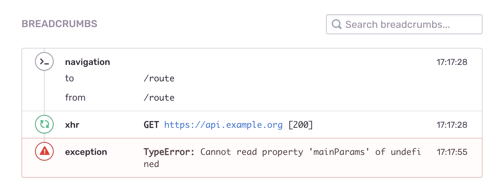
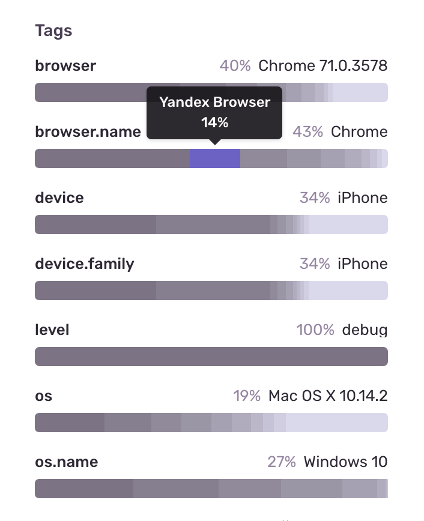
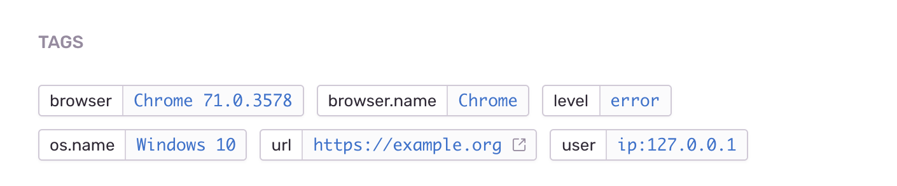
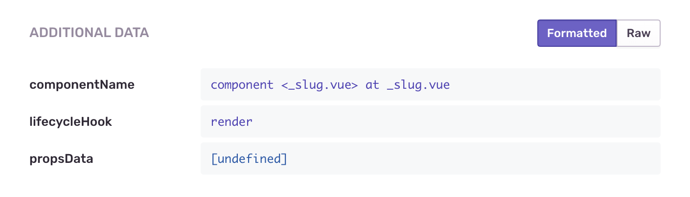

Однажды на&nbsp;работе у&nbsp;меня возникла необходимость логировать некоторые события, происходящие на&nbsp;сайте одного из&nbsp;проектов. Так как вся логика была реализована на&nbsp;клиенте, для этой задачи было решено использовать сервис [Sentry](https://sentry.io), который уже был подключен для логирования ошибок. В&nbsp;этой статье я&nbsp;расскажу как это сделать.

> На&nbsp;самом деле, в&nbsp;[документации](https://docs.sentry.io/) очень подробно описано, как настроить логирование в&nbsp;Sentry, но&nbsp;с&nbsp;первого взгляда она показалась мне неочевидной.

Итак, первое с&nbsp;чем необходимо разобраться, это область видимости (scope). Область видимости нужна для настройки событий, которые мы&nbsp;вызываем. Воспользуемся функцией `withScope` и&nbsp;для примера пометим событие тегом, а&nbsp;также установим для него уровень логирования «warning».

```jsx
Sentry.withScope(scope => {
  scope.setTag("my-tag", "my value");
  scope.setLevel('warning');
  // ✅событие будет помечено тегом my-tag
  Sentry.captureException(new Error('my error'));
});

// 🔴событие не будет помечено тегом my-tag
Sentry.captureException(new Error('my other error'));
```

Теперь разберёмся с&nbsp;тем, как отправить событие.

Нам доступны функции `captureException` и `captureMessage`. Первая предназначена для захвата ошибок. Её&nbsp;удобно использовать в&nbsp;конструкции `try...catch`:

```jsx{4}
try {
    aFunctionThatMightFail();
} catch (err) {
    Sentry.captureException(err);
}
```

Вторая просто отправляет событие с&nbsp;определённым сообщением:

```jsx
Sentry.captureMessage('Something went wrong');
```

Но&nbsp;что делать, если мы&nbsp;вместе с&nbsp;событием, мы&nbsp;хотим собрать какие-то данные и&nbsp;отправить их&nbsp;в&nbsp;Sentry? У&nbsp;нас есть несколько вариантов как это сделать.

**Хлебные крошки `addBreadcrumb`**

Не&nbsp;знаю, в&nbsp;каких кейсах их&nbsp;лучше использовать, но&nbsp;Sentry записывает в&nbsp;них события, которые сработали перед выбросом исключения. Попробуем добавить к&nbsp;событию информацию о&nbsp;пользователе:

```jsx
scope.addBreadcrumb({
  category: 'auth',
  message: 'Authenticated user ' + user.email,
  level: 'info'
});
```

Подробное описание параметров можно посмотреть [в документации](https://docs.sentry.io/enriching-error-data/breadcrumbs/?platform=javascript). В&nbsp;Sentry хлебные крошки выглядят вот так:



**Теги `setTag`**

Хороши тем, что в&nbsp;Sentry по&nbsp;ним можно сделать поиск. Очень удобно, когда необходимо найти определённое событие среди сотен или даже тысяч похожих. Теги записываются в&nbsp;формате ключ-значение:

```jsx
scope.setTag('key', 'value');
```

Sentry на&nbsp;основе тегов строит диаграммы, по&nbsp;которым можно определить, какое количество событий пришло с&nbsp;тем или иным значением тега:



А&nbsp;также можно посмотреть теги для определённого события в&nbsp;виде списка:



**Дополнительные данные `setExtra`** 

Способ отлично подойдёт для логирования большого количества данных. Примечателен тем, что если в `setExtra` передать объект, то&nbsp;в&nbsp;Sentry он&nbsp;отобразится с&nbsp;форматированием и&nbsp;подсветкой синтаксиса. Данные не&nbsp;индексируются, соответственно по&nbsp;ним нельзя выполнить поиск:

```jsx
scope.setExtra('name', data);
```

В&nbsp;Sentry выглядит так:



------

Теперь попробуем собрать всё вместе и&nbsp;отправить событие в&nbsp;Sentry:

```jsx
import * as Sentry from '@sentry/browser';

Sentry.withScope((scope) => {
  scope.setLevel('debug');
  scope.setTag('key', 'value');
  scope.setExtra('name', { data: null });
  Sentry.captureMessage('Test');
});
```

Вот и&nbsp;всё. Этой информации достаточно для начала работы с&nbsp;событиями в&nbsp;Sentry. Полное описание всех возможностей читайте&nbsp;в [документации](https://docs.sentry.io/).

**UPD:** Опытным путём выяснили, что в Sentry по каким-то причинам попадают не все события. Для теста использовали простую функцию, которая отправляет одинаковые JSON-ы с данными на собственный бек и в Sentry одновременно. Некоторой части ивентов в Sentry просто не было. **Будьте осторожны!**